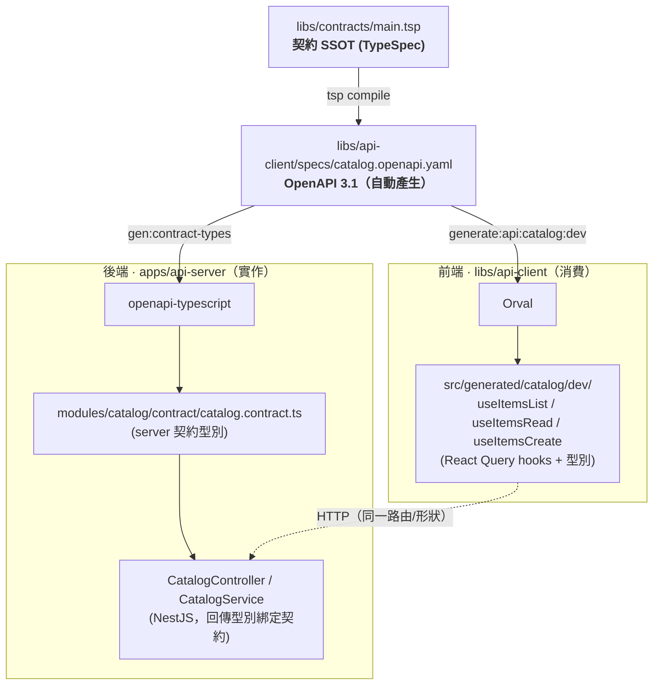

# 契約管線 — TypeSpec → OpenAPI → 前端 + 後端（各司其職）

> T-2026-018。2026-06-26 打通並驗證。對應 `docs/EXECUTION-PLAN-2026H2.md` M1。

一份 TypeSpec 契約為單一事實來源，編譯成 OpenAPI 3.1 後，**前端與後端各自從同一份 OpenAPI 自動衍生**。任一端與契約不一致都會在編譯期被擋下。

## 各司其職



- **契約（libs/contracts）**：定義 API 形狀，唯一事實來源。改這裡才改 API。
- **前端（libs/api-client）**：Orval 由 OpenAPI 產生型別化 React Query hooks，只消費、不定義。
- **後端（apps/api-server）**：openapi-typescript 由**同一份** OpenAPI 產生 server 型別；
  `CatalogController`/`CatalogService` 的回傳型別綁定這些契約型別 — 實作漂移即編譯失敗。

## 一鍵重現（已 pnpm install 的環境）

```bash
# 安裝契約工具（一次）
pnpm --dir libs/contracts install     # @typespec/compiler|http|openapi3

# 全鏈串接
pnpm contracts:wire
#  = contracts:build（main.tsp → OpenAPI 3.1）
#  + generate:api:catalog:dev（OpenAPI → React Query hooks）
#  + api-server gen:contract-types（OpenAPI → server 型別）
```

## 驗證結果（2026-06-26，本機 sandbox）

| 步驟 | 工具 | 結果 |
|------|------|------|
| TypeSpec → OpenAPI 3.1 | @typespec/compiler 1.13 + openapi3 | ✅ 產出 `catalog.openapi.yaml`（openapi: 3.1.0） |
| OpenAPI → 前端 client | Orval 7.13.2 | ✅ 9 檔，含 `useItemsList`/`useItemsRead`/`useItemsCreate`，全數通過語法解析 |
| OpenAPI → 後端型別 | openapi-typescript 7.13 | ✅ `catalog.contract.ts`（ItemType/CatalogItem/CatalogItemPage…） |
| 後端實作綁定契約 | tsc --strict | ✅ 實作形狀符合契約；負向測試：itemType 寫錯值 → 編譯錯誤（契約正確擋下漂移） |

## 與生態的契約 parity

`catalog` 契約刻意對齊：
- ai-search-portal `CatalogApiRow`（itemType、分頁）
- py-able-labs Ex02（itemType camelCase、page/pageSize）

→ 同一套 catalog 語彙貫穿產品線前後端與多 repo。

## 下一步

- 把 `event`/`media` 等既有 spec 也改由 TypeSpec 定義（漸進；目前 catalog 為示範模組）。
- CI 加 `tsp compile` + Spectral lint + oasdiff 破壞性變更檢查（契約治理閘）。
- 後端接 Prisma 取代 in-memory seed。

---

## 更新 2026-06-26 — event/media 收斂到 TypeSpec

`libs/contracts` 由單一 catalog 擴為三模組（`catalog.tsp` / `event.tsp` / `media.tsp`），
`main.tsp` import 三者；`tsp compile` 每個 service 產一份 OpenAPI 3.1：
`catalog/event/media.openapi.yaml`（取代原本 protobuf 衍生的 event/media spec）。

驗證（2026-06-26）：三模組編譯成功（openapi 3.1.0；event 6 paths、media 6 paths、catalog 2 paths），
且各自由 Orval 產出語法有效的 React Query client，operation 名取自 TypeSpec 介面：
`useConsoleEventsList`/`usePublicEventsSearch`/`useImagesBatchDelete`/`useItemsList` 等。

> **重生 client 注意**：本機 sandbox 因掛載封鎖 `unlink`，orval 的 `clean` 無法刪舊檔，
> 故未就地覆蓋 repo 既有 `src/generated/event|media`（仍為舊 protobuf 版、且為 gitignore 產物）。
> 在你本機執行 `pnpm generate:api:all`（或 `generate:api:event:dev`/`media:dev`）即可 clean+重生為新契約版本。

> **欄位命名**：event 沿用原 spec 的 snake_case（cover_image_url、created_at…）以保留既有 wire 契約；
> 錯誤模型以 `RpcStatus` 表示（gRPC-gateway rpcStatus 等價，details 簡化為物件陣列）。
