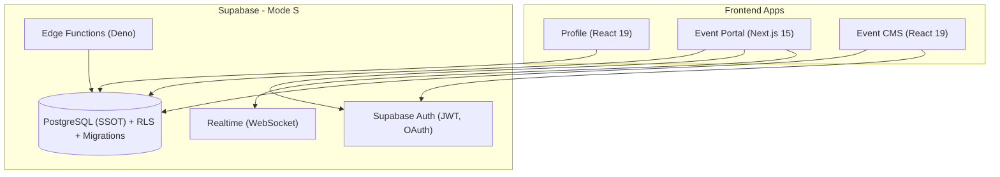

# Backend Architecture - Supabase + NestJS Hybrid

Nx Monorepo 後端架構設計（Mode S: Supabase-led）

---

## 🏗️ 架構概覽



詳細分層（下方 ASCII 保留完整細節）：

```
┌─────────────────────────────────────────────────────────────────┐
│                         Frontend Apps                            │
│  ┌─────────────┐  ┌─────────────┐  ┌─────────────┐             │
│  │   Profile   │  │ Event Portal│  │ Event CMS   │             │
│  │  (React 19) │  │ (Next.js 15)│  │ (React 19)  │             │
│  └──────┬──────┘  └──────┬──────┘  └──────┬──────┘             │
└─────────┼─────────────────┼─────────────────┼───────────────────┘
          │                 │                 │                     
          │ Direct          │ Direct          │ Direct              
          │ Connection      │ Connection      │ Connection          
          │                 │                 │                     
┌─────────▼─────────────────▼─────────────────▼───────────────────┐
│                      Supabase (Mode S)                           │
│  ┌────────────────────────────────────────────────────────────┐ │
│  │  PostgreSQL Database (Single Source of Truth)              │ │
│  │  - RLS Policies (Row Level Security)                       │ │
│  │  - Migrations (DDL only path)                              │ │
│  │  - Tables: posts, post_views, post_view_stats, ...        │ │
│  └────────────────────────────────────────────────────────────┘ │
│                                                                  │
│  ┌────────────────────────────────────────────────────────────┐ │
│  │  Supabase Auth                                              │ │
│  │  - Email/Password                                           │ │
│  │  - Social OAuth (Google, GitHub)                           │ │
│  │  - JWT Tokens                                               │ │
│  └────────────────────────────────────────────────────────────┘ │
│                                                                  │
│  ┌────────────────────────────────────────────────────────────┐ │
│  │  Realtime                                                   │ │
│  │  - WebSocket subscriptions                                  │ │
│  │  - Live view counts, comments, likes                       │ │
│  └────────────────────────────────────────────────────────────┘ │
│                                                                  │
│  ┌────────────────────────────────────────────────────────────┐ │
│  │  Edge Functions (Deno Runtime)                             │ │
│  │  - track-view: Anti-spam view tracking                     │ │
│  │  - send-email: Transactional emails                        │ │
│  │  - process-payment: Payment webhooks (future)              │ │
│  └────────────────────────────────────────────────────────────┘ │
│                                                                  │
│  ┌────────────────────────────────────────────────────────────┐ │
│  │  Storage                                                    │ │
│  │  - User avatars, blog covers, event images                 │ │
│  │  - Public buckets with RLS                                 │ │
│  └────────────────────────────────────────────────────────────┘ │
└──────────────────────────────────────────────────────────────────┘
                                │                                    
                                │ Read-only                          
                                │ (Complex queries)                  
                                ▼                                    
┌──────────────────────────────────────────────────────────────────┐
│                   NestJS API Server (Optional)                    │
│  - Complex business logic                                         │
│  - Aggregated reports                                             │
│  - Third-party integrations                                       │
│  - Prisma (read-only, no DDL)                                     │
└──────────────────────────────────────────────────────────────────┘
```

---

## 🎯 設計原則

### 1. Single Source of Truth (SSOT)

**Supabase 為唯一 DDL 路徑**

- ✅ 所有 schema 變更在 Supabase SQL Editor 執行
- ✅ Migrations 儲存在 `libs/supabase-client/sql/`
- ❌ **禁止** `prisma migrate dev` 改表
- ❌ **禁止** 在 Supabase Studio 與 Prisma 雙軌變更

**Prisma 角色**:
- ✅ 型別生成 (`prisma generate`)
- ✅ Query client（read-only）
- ❌ Schema 變更（DDL）

### 2. Security-First

**RLS (Row Level Security) 預設拒絕**

```sql
-- 預設策略：deny all
ALTER TABLE posts ENABLE ROW LEVEL SECURITY;

-- 逐步開放讀取
CREATE POLICY "Anyone can read published posts"
  ON posts FOR SELECT
  TO anon, authenticated
  USING (published_at IS NOT NULL);

-- 嚴格限制寫入
CREATE POLICY "Only service role can insert views"
  ON post_views FOR INSERT
  TO service_role
  WITH CHECK (true);
```

**Key Management**:
- ✅ Anon key: 前端可用（公開）
- ❌ Service role key: 僅伺服器（Edge Functions）
- ❌ **絕不** commit keys 到 git

### 3. Cost Optimization

**View Tracking 成本控管**

```typescript
// 1. Edge Function 節流（1 hour window）
const RATE_LIMIT_WINDOW_MS = 60 * 60 * 1000;

// 2. IP Hashing（隱私 + 去重）
const ipHash = await hashIP(clientIP);

// 3. 彙總表查詢（避免掃描原始表）
SELECT * FROM post_view_stats WHERE post_id = '2024-12';
```

**Realtime 限流**:
```typescript
realtime: {
  params: {
    eventsPerSecond: 10, // 限制事件頻率
  },
}
```

### 4. Progressive Enhancement

**階段式功能上線**

- **Phase 1 (Week 1-2)**: Blog 閱讀數 ✅
- **Phase 2 (Week 3-4)**: Auth + Comments
- **Phase 3 (Week 5-6)**: Likes + Realtime
- **Phase 4 (Future)**: Payment + CMS

---

## 📊 資料模型

### 核心表格

#### `posts`
```sql
CREATE TABLE posts (
  id UUID PRIMARY KEY,
  slug TEXT UNIQUE NOT NULL,        -- e.g., "2024-12"
  title TEXT NOT NULL,
  excerpt TEXT,
  published_at TIMESTAMPTZ,
  created_at TIMESTAMPTZ DEFAULT NOW()
);
```

**用途**: 對應 `specs/blogs/*.md`，作為 views 的 foreign key

#### `post_views`
```sql
CREATE TABLE post_views (
  id UUID PRIMARY KEY,
  post_id TEXT NOT NULL,            -- slug as FK
  ip_hash TEXT NOT NULL,            -- SHA-256 hash
  user_id UUID,                     -- Optional (if logged in)
  created_at TIMESTAMPTZ DEFAULT NOW()
);
```

**用途**: 原始閱讀記錄，僅 Edge Function 可寫入

#### `post_view_stats`
```sql
CREATE TABLE post_view_stats (
  post_id TEXT PRIMARY KEY,
  total_views INTEGER DEFAULT 0,
  unique_ips INTEGER DEFAULT 0,
  last_updated TIMESTAMPTZ DEFAULT NOW()
);
```

**用途**: 彙總統計，供前端快速查詢

### 未來擴展

- `comments`: 留言功能
- `post_likes`: 按讚功能
- `profiles`: 使用者檔案
- `events`: Event Platform 資料

---

## 🔐 Security Model

### RLS Policies

| Table            | SELECT (Read)        | INSERT (Write)         | UPDATE          |
|------------------|----------------------|------------------------|-----------------|
| `posts`          | anon, authenticated  | service_role           | service_role    |
| `post_views`     | anon, authenticated  | **service_role only**  | N/A             |
| `post_view_stats`| anon, authenticated  | service_role           | service_role    |

### Auth Flow

```
1. User visits blog post
2. Frontend calls Edge Function (with anon key)
3. Edge Function uses service_role to insert view
4. Stats updated via DB function
5. Frontend displays stats (read with anon key)
```

### IP Hashing

```typescript
// Edge Function
async function hashIP(ip: string): Promise<string> {
  const encoder = new TextEncoder();
  const data = encoder.encode(ip);
  const hashBuffer = await crypto.subtle.digest('SHA-256', data);
  // Return hex string
}
```

**隱私保護**: 原始 IP 永不儲存

---

## 🚀 部署策略

### Environment Separation

| Environment | Supabase Project    | Domain                  |
|-------------|---------------------|-------------------------|
| Development | dev-project         | localhost:3003          |
| Staging     | staging-project     | staging.domain.com      |
| Production  | production-project  | domain.com              |

### Deployment Pipeline

```bash
# 1. SQL Migrations (手動)
# Supabase Dashboard → SQL Editor → Run migration

# 2. Edge Functions (自動化)
supabase functions deploy track-view

# 3. Frontend Apps (Cloudflare Pages)
nx build @nx-playground/profile --configuration=production
# Deploy to Cloudflare Pages

# 4. NestJS (Optional, Fly.io/Railway)
nx build @nx-playground/api-server
# Deploy to container platform
```

---

## 📈 監控與維護

### Supabase Dashboard

- **Database**: Table sizes, query performance
- **Auth**: Active users, sign-ups
- **Realtime**: Active connections
- **Storage**: Bucket usage
- **Functions**: Invocations, errors

### Alerts (設定建議)

- Database > 80% of free tier (400MB)
- Functions > 400K invocations/month
- Realtime connections > 100 concurrent

### 定期任務

```sql
-- 每月清理舊 views (保留 stats)
DELETE FROM post_views 
WHERE created_at < NOW() - INTERVAL '30 days';
```

---

## 🔧 Nx Monorepo 整合

### Libraries

```
libs/
  supabase-client/       # Supabase SDK 封裝
    src/
      lib/
        client.ts         # Client factory
        types.ts          # Database types
        hooks/
          usePostViews.ts # React hooks
      sql/
        001_initial_schema.sql
  
  api-types/             # Shared TypeScript types
  domain/                # Business logic (pure functions)
```

### Apps

```
apps/
  profile/               # React (Vite)
    - Direct Supabase connection
    - Blog views, future auth
  
  event-portal/          # Next.js (App Router)
    - Direct Supabase connection
    - Event browsing, registration
  
  event-cms/             # React (Vite)
    - Direct Supabase connection
    - Event management
  
  api-server/            # NestJS (Optional)
    - Read-only Prisma
    - Complex aggregations
    - Third-party integrations
```

### Nx Targets

```json
{
  "supabase:generate-types": "supabase gen types typescript",
  "supabase:deploy": "supabase functions deploy",
  "prisma:generate": "prisma generate --schema=./schema.prisma"
}
```

---

## 🎓 決策紀錄

### 為何選擇 Supabase？

1. **PostgreSQL 一致性**: 與 NestJS/Prisma 使用同一資料庫
2. **即時資料**: Realtime subscriptions（符合 IoT 經驗）
3. **開源**: 可自架，避免 vendor lock-in
4. **TypeScript 優先**: 與 Nx monorepo 完美整合
5. **Edge Functions**: Deno runtime，輕量快速

### 為何保留 NestJS？

1. **複雜業務邏輯**: 多步驟交易、審計
2. **第三方整合**: Payment gateways, email providers
3. **報表生成**: 複雜 SQL aggregations
4. **學習展示**: 展示多種後端技術

### 為何不用 Firebase？

1. **NoSQL 斷層**: 團隊經驗都是 SQL
2. **Schema 不一致**: 與現有 api-server 難整合
3. **Vendor lock-in**: 遷移成本高
4. **查詢限制**: Firestore 複雜查詢困難

---

## 🔗 參考資料

- [Supabase Docs](https://supabase.com/docs)
- [Supabase RLS Guide](https://supabase.com/docs/guides/auth/row-level-security)
- [Edge Functions Docs](https://supabase.com/docs/guides/functions)
- [Nx Monorepo Docs](https://nx.dev)
- [Project Status](../../specs/PROJECT_STATUS.md)
- [Setup Guide](./SUPABASE_SETUP.md)

---

最後更新：2025-10-27
作者：Tess (nx-playground maintainer)

